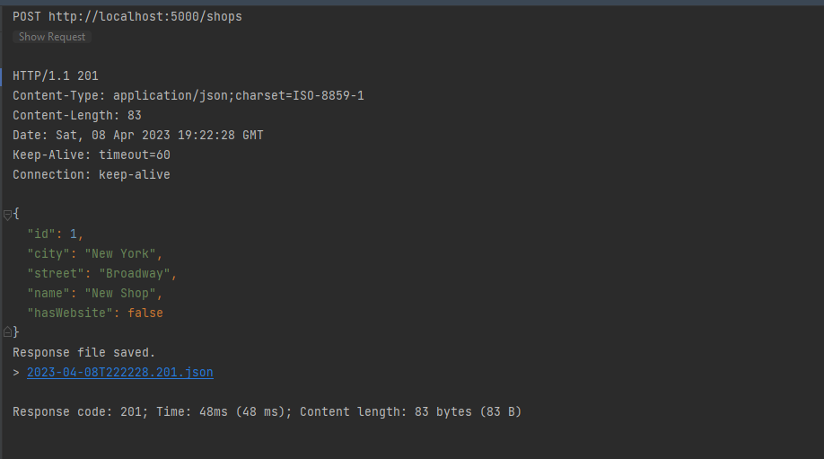

# Cursor current Task:

```agsl
1. Створити проект( чи використати з минулої домашки “Shops”), використати модель магазину, і створити методи POST, GET  які приймають httpservletrequest та httpservletresponse та серіалізувати їх за допомогою Object Mapper( чи іншого інструменту наприклад Gson ) в java класи (а не спрінгом). 

 2. В проекті “Shops” використати патерн DTO де приховати кількість співробітників магазину. Модель магазину містила такі поля(айді, місто та вулиця де знаходиться магазин, назва магазину і кількість співробітників, та поле чи є у магазина сайт).```
 

## For project need install nodejs v18.14.0, jdk 17.0.1, and gradle 7.6, docker and docker-compose:
1. [Install nodejs](https://nodejs.org/en/download/)
2. [Install jdk use jvms](https://github.com/ystyle/jvms)
3. [Install gradle](https://gradle.org/install/)
4. [Install docker](https://docs.docker.com/engine/install/)
5. [Install docker-compose](https://docs.docker.com/compose/install/)
```

## For run project need run command:

```bash
# Run docker-compose
docker-compose up -d
# do npm install
npm install
# do npm run build
npm run build
# do gradle build
gradle build
# do gradle bootRun
gradle bootRun
# do run test
gradle test
# go to http://localhost:5000 you will see the page react
# go to http://localhost:5000/api
```


